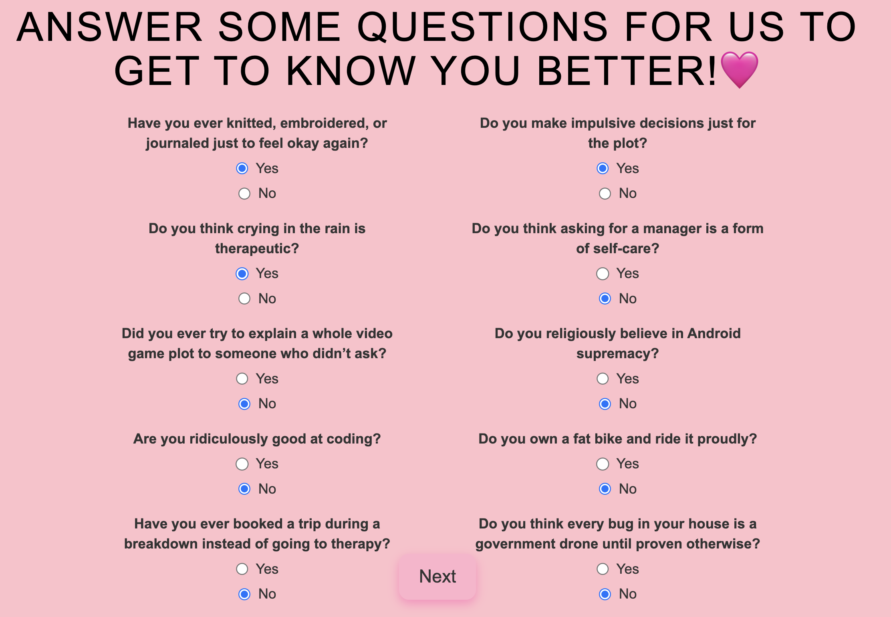
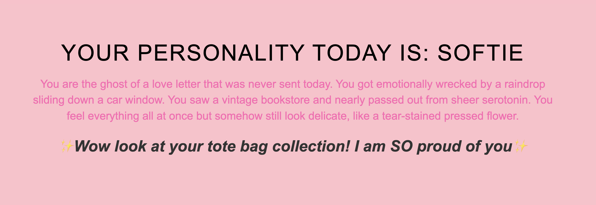

```{r, include = FALSE}
knitr::opts_chunk$set(
  collapse = TRUE,
  comment = "#>"
)
```

## Introduction

The `affirmations` R package was created as part of the *Programming the Next Step* course. It provides a playful, interactive Shiny web application that classifies users into fun personality types based on pop-culture themed yes/no questions and returns a randomized affirmation tailored to their result.

------------------------------------------------------------------------

## Package Purpose

The goal of the package is to:

-   Deliver a personality quiz experience in a Shiny interface.
-   Classify users based on their yes/no answers.
-   Display personality-specific affirmations drawn from a curated set of motivational or comedic lines.

Currently, the app supports five personality types:

-   **Softie**
-   **Brat Summer Girl**
-   **Hyperfixated Internet Nerd**
-   **Millennial Core**
-   **Radical Righty**

Each personality includes:

-   A pool of specific classification questions (around 10 for each)
-   A randomized affirmation bank with 10–15 custom entries per type

------------------------------------------------------------------------

## Functionality Overview

The Shiny app walks users through a 10-question yes/no quiz and presents them with:

1.  Their classified personality
2.  A randomized affirmation linked to their result
3.  A chance to retake the quiz and get a new affirmation

The classification is based on a weighted tally of responses and uses randomized selection in case of ties. Affirmations are sampled using a built-in helper function.

------------------------------------------------------------------------

## Main functions

The `affirmations` package includes two main user-facing functions:

### `get_affirmation()`

This function launches the Shiny application included in the package. The app opens in the default web browser and allows users to take a short quiz that classifies them into a personality type and returns a randomized affirmation.

**Usage:**

``` r
library(affirmations)

# Launch the Shiny app
get_affirmation()
```

**Details:**

-   The function internally checks if the app directory exists within the installed package using `system.file()`.
-   If the directory is found, it uses `shiny::runApp()` to launch the app.
-   If the app folder cannot be located (e.g., due to an incorrect or partial installation), an informative error message is shown.

------------------------------------------------------------------------

### `random_affirmation()`

This helper function samples and returns a single affirmation randomly selected from **any** of the personality types. It is useful for users who want an affirmation without taking the full quiz.

**Usage:**

``` r
library(affirmations)

# Get a random affirmation across all types
random_affirmation()
#> [1] "✨You’re basically a walking 'me in every situation' GIF✨"
```

**Details:**

-   The function pulls affirmations from the internal `personality_data` list (which contains affirmations grouped by personality type).
-   All affirmations are unlisted and pooled together, and a single affirmation is sampled at random using `sample()`.

These two functions provide both structured and spontaneous access to affirmations, depending on the user’s preference.

------------------------------------------------------------------------

## App Interface Screenshots

### Page 1: Start Page

This is the landing page of the app. Users see a welcome message and a "Next" button to begin the experience.

```{r screenshot1, echo=FALSE, out.width="100%"}

```

------------------------------------------------------------------------

### Page 2: Quiz Questions

On this screen, users are presented with 10 themed yes/no questions, two from each personality category. Clicking "Next" processes the responses.

```{r screenshot2, echo=FALSE, out.width="100%"}

```

------------------------------------------------------------------------

### Page 3: Results Page

Here, users are shown:

-   Their classified personality type
-   A randomized affirmation drawn from that type's set
-   An option to retake the quiz and get a new affirmation

```{r screenshot3, echo=FALSE, out.width="100%"}

```

------------------------------------------------------------------------

## Conclusion

This package showcases a creative way to build playful, personality-based applications in Shiny and distribute them as R packages. The modular structure and GitHub integration enable easy updates and playful experimentation.
